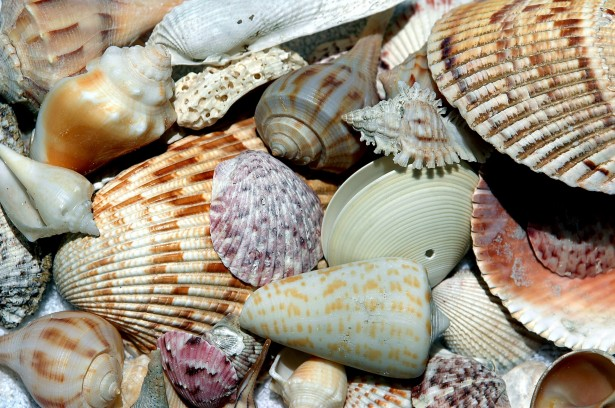

# Shell Ground

# Introduction

[https://github.com/vietphan1995/shell-ground.git](https://github.com/vietphan1995/shell-ground.git)

Shell ground is a research project about new material can be built ground, brick, concrete block which contains a percentage of shell, snail with old material like cement, rock, iron …

Shell ground reduces climate change problems like reducing rocks in rail track, street ground, house ground, reducing cement material in concrete block, friendly with animals …

### Notes
https://six-zinc-ad4.notion.site/Shell-Ground-1b25e832d6ee802ea95ecd69570cc329